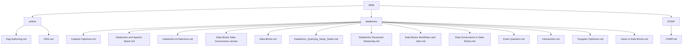

# DEM (Data Engineer Mind)

Welcome to the **DEM**  repository, representing a data engineer virtual mind which houses all my notes and knowledge related to various data engineering topics. These notes cover everything from tools and frameworks to best practices, architectures, and key concepts. This repository is organized into different categories, each representing a distinct area of data engineering.

## Project Structure

Here is the directory structure of this repository:

